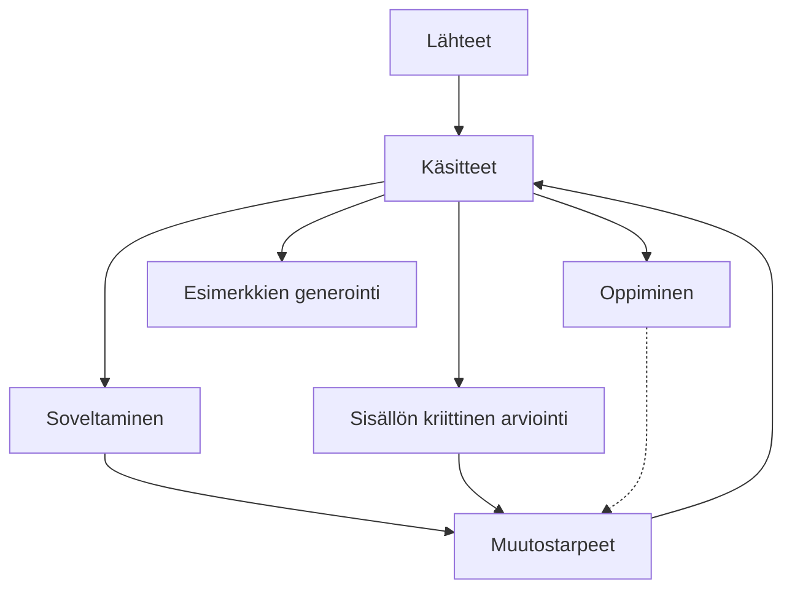

Tämä pääosin koneellisesti tuotettu sivusto on esimerkki LLM-wikistä.
Sivusto toteutuu [[ajatteluharhat-skill|Ajatteluharhat-skill]] ohjeen mukaisesti.

LLM-wiki-ideasta voi lukea tarkemmin täältä (ulkoinen linkki): [Karpathy LLM-wiki](https://gist.github.com/karpathy/442a6bf555914893e9891c11519de94f)

LLM-wikin keskeisiä hyötyjä ovat:
- Asiantuntijan valitsemat luotettavat lähteet yleisen kielimallin yleisen tiedon sijaan
- Suurestä määrästä/ laajoista lähteistä voidaan tiivistää keskeinen sisältö 
- Keskeinen sisältö voidaan esittää helposti luettavassa rakenteellisessa muodossa ja sisältö voidaan linkittää
- Tekoälyagentti voi muodostaa vastauksen wikin tietojen perusteella ja vastaus itsessään takaisin syötettynä kehittää wikin sisältöjä
- Wikin voi rakentaa siten, että sekä wikin sisältö että agentin käyttämä kielimalli ovat paikallisella tietokoneella, mikäli näin halutaan. 

LLM-wikin haittoja ovat:
- Wikin sisällöt ovat agentin tuottamia, jolloin lähteiden sisällöt saattavat sisältää hallusinaatioida 
- Toisin kuin RAG (retrieval augmentit generation) wiki ei yleensä tuota/käytä sanatarkkoja lainauksia lähdeteksteistä. Sivustoa on kuitenkin helppo täydentää RAG-ratkaisulla.

Näin wiki toimii:

Wiki ja koko sivusto luodaan [[sivusto-skill|Sivusto-skill]] taidolla, jonka laajaa kielimallia toteuttaa.  

Sivuston lähteinä ovat Dobellin (julkisista lähteistä rekonstruoituna)  ja Mungerin ("The Psychology of Human Misjudgment" essee) tunnistamat ajatteluharhat, joista agentti on tunnistanut keskeiset käsitteet. Käsitteitä ei ole kopioitu sellaisenaan lähteistä vaan ne ovat agentin tulkintoja lähteistä. Tulkinnasta keskeistä on, että agentti on:
- tiivistänyt alkuperäistä ilmaisua
- kuvannut käsitteet rakenteellisesti
- luokitellut ja linkittänyt käsitteet toisiinsa
- luonut uutta sisältöä, kuten esimerkiksi erotteludiagnostiikka 

Toteutuksessa lähteitä voi vapaasti lisätä kansioon, ja tämän jälkeen agentti päivittää sivuston sisällön automaattisesti. 

Käsitteiden soveltamisesimerkkeinä käytetään Iltalehden ja Iltasanomien valikoituja terveysaiheisia uutisia. Soveltamisessa agentti analysoi artikkelin sivuston käsitteiden (ns. luotettu lähde) avulla ja tuottaa analyysin. Analyysit ovat löytyvät osiosta [[soveltaminen-koonti|Soveltaminen]]

Sisällön arvioinnissa agentti käy läpi käsitteet ja tunnistaa ongelmia, ristiriitaisuuksia ja muita puutteita. 

Sovellusesimerkkien ja sisällön arvioinnin perusteella tunnistetaan [[muutostarpeet-koonti|Muutostarpeet]], joiden toteuttaminen kehittää käsitteitä. 

Agentti generoi myös esimerkkejä, kts. [[harjoituksia-koonti|Harjoituksia]]

Kokonaisuuteen kuuluu myös Oppiminen, jossa agentti käy vuoropuhelua käyttäjän kanssa ja  samalla ylläpitäen tietoa käyttäjän lähikehityksen vyöhykeestä eli mitä käyttäjä jo osaa soveltaa, mitä ei ja mikä olisi seuraava opittava asia tarkalleen ottaen. Näin tarkasti ottaen: [[opettaja-skill|Opettaja-skill]] . Esimerkki oppimislokista näkyy täällä [[oppimisloki|Oppimisloki]]. Tässä esimerkissä oppilas on 5:llä luokalla

Oppimisesta muutostarpeisiin toiminnallisuutta (katkoviiva yllä kuvassa) ei ole vielä toteutettu (28.6.2026). 

