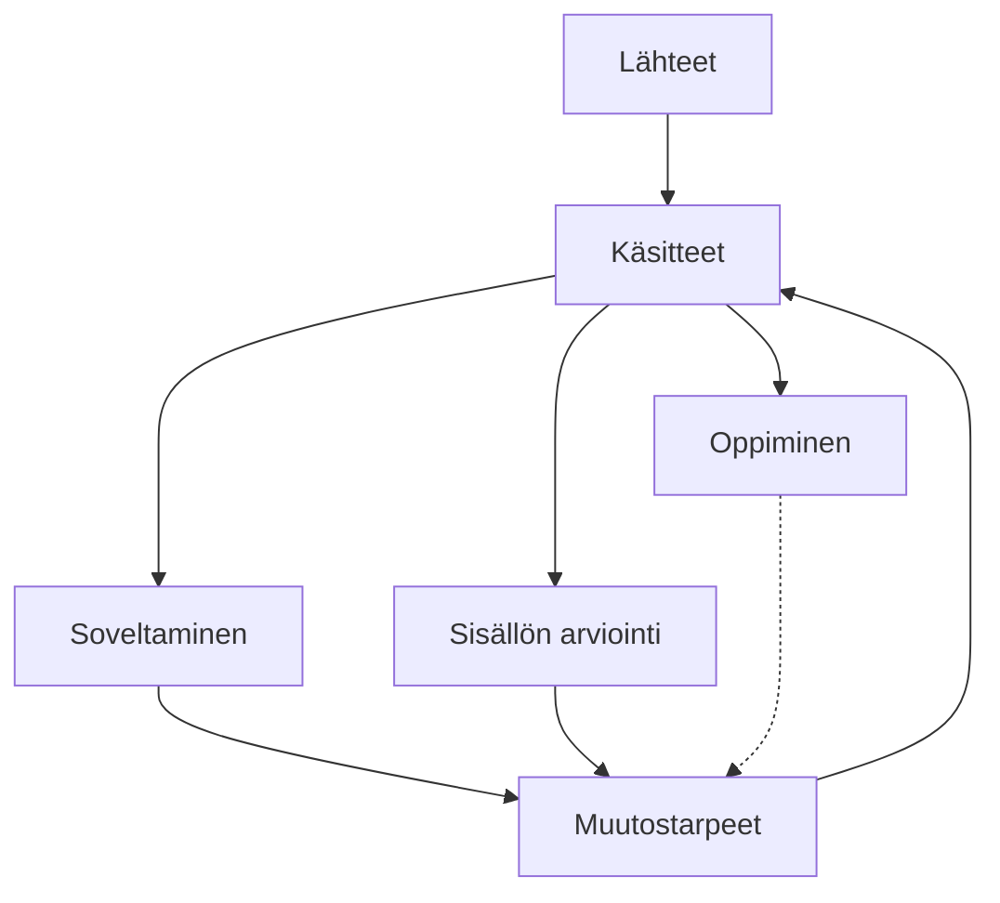

Tämä koneellisesti tuotettu sivusto on esimerkki LLM-wikistä.

LLM-wikin keskeisiä hyötyjä ovat:
- Asiantuntijan valitsemat luotettavat lähteet yleisen kielimallin yleisen tiedon sijaan
- Suurestä määrästä/ laajoista lähteistä voidaan tiivistää keskeinen sisältö 
- Tekoälyagentti voi muodostaa vastauksen wikin tietojen perusteella ja vastaus itsessään takaisin syötettynä kehittää wikin sisältöjä (kts. alla Soveltaminen) 
- Wikin voi rakentaa siten, että sekä wikin sisältö että agentin käyttämä kielimalli ovat paikallisella tietokoneella

LLM-wikin haittoja ovat:
- Wikin sisällöt ovat agentin tuottamia, jolloin lähteiden sisällöt saattavat vääristyä 
- Toisin kuin RAG (retrieval augmentit generation) wiki ei yleensä tuota/käytä sanatarkkoja lainauksia lähdeteksteistä

Näin wiki toimii:

Sivuston lähteinä ovat Dobellin (julkisista lähteistä rekonstruoituna)  ja Mungerin ("The Psychology of Human Misjudgment" essee) tunnistamat ajatteluharhat, joista agentti on tunnistanut keskeiset käsitteet. Toteutuksessa lähteitä voi vapaasti lisätä kansioon, ja tämän jälkeen agentti päivittää sivuston sisällön. 

Käsitteiden soveltamisesimerkkeinä käytetään Iltalehden ja Iltasanomien valikoituja terveysaiheisia uutisia. Soveltamisessa agentti analysoi artikkelin sivuston käsitteiden avulla ja tuottaa analyysiraportin. 

Sisällön arvioinnissa agentti käy läpi käsitteet ja tunnistaa ongelmia, ristiriitaisuuksia ja muita puutteita. 

Sovellusesimerkkien ja sisällön arvioinnin perusteella tunnistetaan muutostarpeet, joiden toteuttaminen kehittää käsitteitä. 

Kokonaisuuteen kuuluu myös Oppiminen, jossa agentti käy vuoropuhelua käyttäjän kanssa ja  samalla ylläpitäen tietoa käyttäjän lähikehityksen vyöhykeestä eli mitä käyttäjä jo osaa soveltaa, mitä ei ja mikä olisi seuraava opittava asia tarkalleen ottaen. Oppimisesta muutostarpeisiin toiminnallisuutta ei ole vielä toteutettu. 

