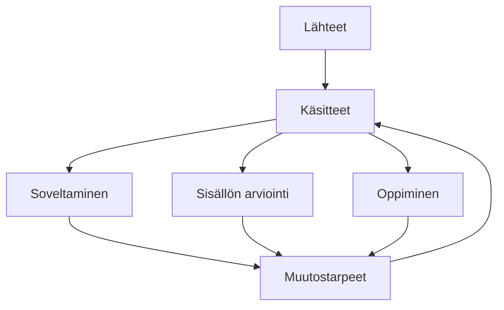

Tämä koneellisesti tuotettu sivusto on esimerkki LLM-wikistä.

Sivuston lähteinä ovat Dobellin (julkisistä lähteistä rekonstruoituna)  ja Mungerin (The Psychology of Human Misjudgment) tunnistamat ajatusharhat, joista laaja kielimalli on tunnistanut keskeiset käsitteet. Lähtedokumentteja voi lisätä kansioon tarpeen mukaan.

Käsitteiden soveltamisesimerkkeinä käytetään Iltalehden ja Iltasanomien valikoituja terveysaiheisia uutisia. 

Arvioinnissa laaja kielimalli käy läpi käsitteet ja tunnistaa ongelmia, ristiriitaisuuksia ja muita puutteita. 

Sovellusesimerkkien (=sisällön käyttäminen) ja arvioinnin perusteella tunnistetaan muutostarpeet, joiden toteuttaminen kehittää käsitteitä. 

Kokonaisuuteen kuuluu myös Oppiminen, jossa laaja kielimalli käy vuoropuhelua käyttäjän kanssa samalla ylläpitäen tietoa käyttäjän lähikehityksen vyöhykettä. 
